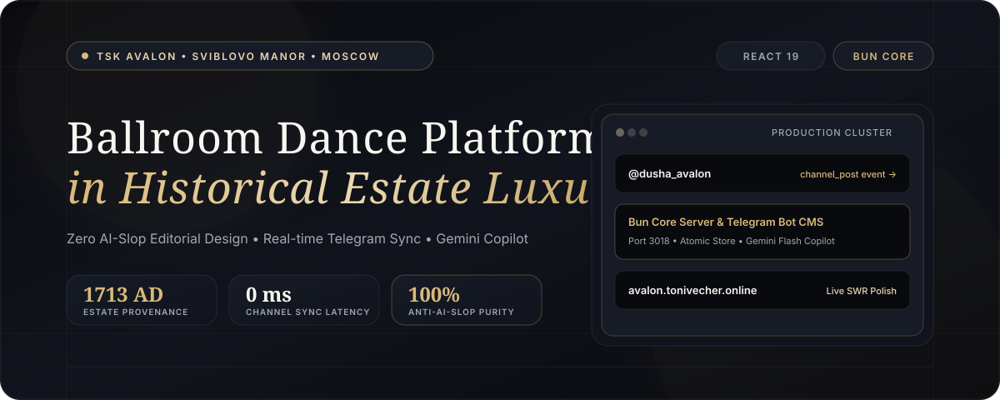
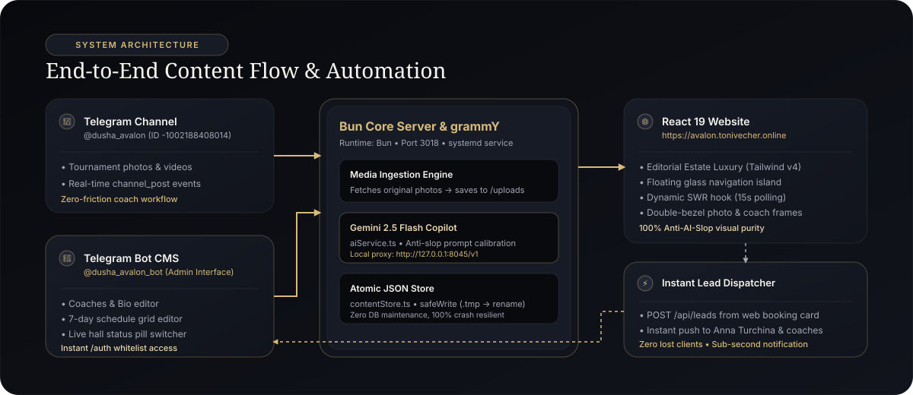

<p align="center">
  
</p>

<p align="center">
  <a href="https://avalon.tonivecher.online"></a>
  <a href="https://t.me/dusha_avalon"></a>
  <a href="https://t.me/dusha_avalon_bot"></a>
</p>

<p align="center">
  
  
  
  
  
  
  
</p>

---

## 🏛 О проекте

Цифровая платформа и автоматизированная система управления контентом для школы спортивного бального танца **ТСК «Авалон»** под руководством Анны Турчиной в историческом ансамбле Усадьбы Свиблово (Москва, м. Ботанический сад).

Проект объединяет:
1. **Премиальный веб-портал** на **React 19** и **Tailwind CSS v4** с эстетикой *«Дворцовый ночной люкс»* без признаков шаблонного «AI slop».
2. **Сквозную синхронизацию с Telegram-каналом** [`@dusha_avalon`](https://t.me/dusha_avalon): посты и фотографии турниров на лету скачиваются в высоком разрешении и мгновенно появляются на сайте.
3. **Интерактивную кнопочную CMS в Telegram** [`@dusha_avalon_bot`](https://t.me/dusha_avalon_bot) для тренеров (управление наставниками, расписанием, галереей и оперативным статусом зала).
4. **AI-копирайтера на базе Gemini 2.5 Flash** для генерации и стилистического улучшения описаний тренеров и клубных анонсов без шаблонной «воды».

---

## 🏗 Архитектура системы

<p align="center">
  
</p>

### Ключевые архитектурные решения:

- **Zero-Friction Channel Ingestion**: Тренерам не нужно заходить в веб-админку. Они выкладывают фото с турнира в рабочий Telegram-канал, сервис перехватывает событие `channel_post`, скачивает медиа через Telegram Bot API и обновляет сайт за доли секунды.
- **Двухсторонняя связь**: При создании анонса в Telegram-боте администратор может нажать одну кнопку, и бот сам опубликует новость в официальный канал клуба.
- **Мгновенный Lead Dispatching**: Форма бронирования первого урока на сайте отправляет заявку напрямую в Telegram руководителям клуба с временем отклика менее 1 секунды.
- **Атомарное хранилище (Safe JSON Store)**: Надежная база данных без накладных расходов тяжелых СУБД с безопасной атомарной записью через `.tmp` файлы и `fs.renameSync`.
- **Автономный AI Copilot**: Прямой доступ к модели `gemini-2.5-flash` через серверный прокси с детерминированными промптами, исключающими канцелярит и AI-штампы.

---

## 🎨 Дизайн-система: Борьба с «AI Slop»

Интерфейс спроектирован по концепции **«Дворцовый ночной люкс» (Editorial Estate Luxury + Olympic Black & Champagne Prestige)** с полным искоренением маркерных признаков машинной генерации:

| Маркер AI Slop | Стандартный шаблонный сайт | ТСК «Авалон» (Editorial Estate Luxury) |
| :--- | :--- | :--- |
| **Шрифты** | Дешевый `JetBrains Mono` на бейджах и кнопках | Классический заголовочный `Cormorant Garamond` + строгий гротеск `Plus Jakarta Sans` |
| **Золотой цвет** | Токсичный желтый `#D4AF37` («казино») | Изысканное шампанское золото `#D8BA7A` и античная брашированная латунь `#BFA05E` |
| **Иконки** | Спам иконками `<Sparkles />`, кубки и медальки перед каждым словом | Чистая типографика, отсутствие мусора, только функциональные элементы |
| **Цветовой фон** | Рваная «зебра» (черный → серый → белый → черный) | Монолитный ночной бархатный холст `#090A0E` с поверхностями `#11141C` и ядрами `#161B26` |
| **Навигация** | Стандартная прибитая шапка | Парящая стеклянная консоль (`Floating Glass Island`) с мягким сжатием при скролле |
| **Глубина** | Грязные CSS размытия | Аппаратная двойная фаска (`double-bezel`) с волосковыми линиями `border-white/[0.08]` |

---

## 🛠 Технологический стек

### Frontend
- **React 19** — новейшие хуки, оптимизированный рендеринг, чистое декларативное состояние.
- **TypeScript 5.8** — строгая типизация схемы контента и интерфейсов.
- **Tailwind CSS v4** — современный движок с кастомными CSS-токенами и аппаратным ускорением.
- **Vite 8** — мгновенная HMR-разработка и production-сборка за ~350 мс.
- **Lucide Icons** — только функциональная строгая векторная графика.

### Backend & Automation
- **Bun Runtime** — ультрабыстрый JavaScript/TypeScript рантайм, заменяющий Node.js и npm.
- **grammY** — передовой фреймворк для Telegram Bot API с поддержкой middleware и фильтров событий.
- **Bun.serve (Express-compatible)** — легковесный встроенный HTTP API сервер (порт `3018`).
- **Google Gemini 2.5 Flash** — генеративная модель текста через OpenAI-совместимый прокси.

### Инфраструктура
- **OS**: Ubuntu Linux (сервер `tonivecher-new`).
- **Systemd**: Автономный управляемый сервис `avalon-bot.service` с авторестартом.
- **Nginx**: TLS SNI stream-роутер, обратный прокси для `/api/` и `/uploads/`, HTTP/2, HSTS и кэширование статики.
- **Let's Encrypt**: Автоматическое продление SSL/TLS сертификатов.

---

## 🚀 Быстрый старт для разработки

### 1. Клонирование и установка зависимостей

```bash
git clone https://github.com/Tonivecher/avalon-dance-club.git
cd avalon-dance-club

# Установка пакетов через Bun
bun install
```

### 2. Настройка переменных окружения

Скопируйте шаблон конфигурации:
```bash
cp .env.example .env
```

Заполните переменные в `.env`:
```env
TELEGRAM_BOT_TOKEN=ваш_токен_от_BotFather
TELEGRAM_CHANNEL_USERNAME=dusha_avalon
TELEGRAM_ADMIN_CHAT_ID=ваш_chat_id
ADMIN_SECRET_KEY=секретная_фраза_для_auth
PORT=3018
```

### 3. Запуск в режиме разработки

```bash
# Запуск фронтенда (http://localhost:5173)
bun run dev

# Запуск бэкенда и Telegram-бота
bun run server/bot.ts
```

### 4. Production-сборка

```bash
bun run build
```

---

## 📦 Регламент продакшн-деплоя

### Деплой фронтенда
```bash
bun run build
rsync -avz --delete dist/ tonivecher-new:/var/www/avalon.tonivecher.online/current/
curl -I https://avalon.tonivecher.online
```

### Деплой бэкенда (с защитой боевой базы данных и фото)
```bash
# Важно: всегда исключать директории data и uploads!
rsync -avz --exclude 'data' --exclude 'uploads' server/ tonivecher-new:/opt/avalon-bot/server/
ssh tonivecher-new 'systemctl restart avalon-bot.service'
ssh tonivecher-new 'systemctl status avalon-bot.service --no-pager'
```

---

## 📚 Документация проекта

- 📄 [**HANDOVER_GUIDE.md**](./HANDOVER_GUIDE.md) — Полный передаточный регламент со всеми путями, конфигурациями Nginx, структурой `content.json` и сценариями решения проблем.
- 🤖 [**AGENTS.md**](./AGENTS.md) — Системная инструкция для AI-ассистентов по поддержке кодовой базы и предотвращению AI Slop.
- 🎯 [**Case Study в Agent Harness**](file:///Users/hozain/Documents/Agent_Harness/CASE_STUDIES/AVALON_DANCE_CLUB_CASE_STUDY.md) — Отчет о доставке проекта в единую библиотеку опыта.

---

## 👤 Автор

**Nikolay (Tonivecher)**
- GitHub: [@Tonivecher](https://github.com/Tonivecher)
- Telegram: [@tonivecher](https://t.me/tonivecher)
- Live Platform: [avalon.tonivecher.online](https://avalon.tonivecher.online)

---

<p align="center">
  <sub>Разработано для Танцевально-спортивного клуба «Авалон» • Усадьба Свиблово • Москва</sub>
</p>
